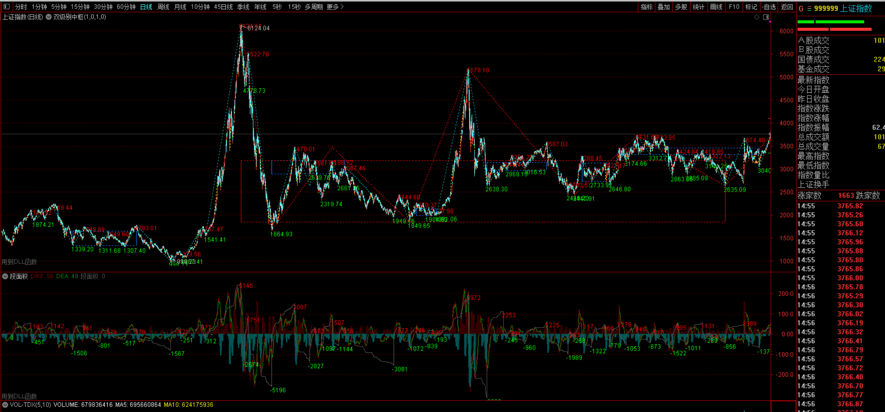

# pf2

#### 介绍
写于十几年前飞狐软件纯C语言的飞狐版缠论公式DLL，现在改造为通达信版本

#### 安装教程

编译成32位，下面以Visual Studio 2019举例，作者用的是MS Builder。
在VSCode 里设置运行任务：

{
    // See https://go.microsoft.com/fwlink/?LinkId=733558
    // for the documentation about the tasks.json format
    "version": "2.0.0",
    "tasks": [
        {
            "label": "build",
            "type": "shell",
            "command": "msbuild",
            "args": [
                "FoxFunc.vcxproj",
                "/p:Configuration=Debug",
                "/p:Platform=Win32"
            ],
            "group": {
                "kind": "build",
                "isDefault": true
            },
            "presentation": {
                "reveal": "silent"
            },
            "problemMatcher": "$msCompile"
        }
    ]
}
#### 通达信中使用

顶底:=TDXDLL1(1,0,H,L);
DRAWLINE(顶底=-9,L,顶底=+9,H,0), DOTLINE,LINETHICK1,COLORYELLOW;
DRAWLINE(顶底=+9,H,顶底=-9,L,0), DOTLINE,LINETHICK1,COLORYELLOW;

#### 特色
解决走势延伸，背了又背等问题。同时为了自动化交易要把行情中的各种信号留痕包括假信号也保留以便盘后统计分析。

由于千人千缠，作者理解的缠论操作与其他人不太一样，但践行的是原缠不作任何修改和扩展。
首先是操作级别与观察级别，一般人方便拿到的数据最低就是1分钟K线，所以最低的级别就是1分钟的段走势，但是由于段走势也容易被笔破坏，以1F段做操作也不可靠，因此在一个闭环的买卖点循环里，只有1F段以上的级别才是稳定和可靠的，当以第一买点也就是两个1F段中枢构成的标准背驰走势才是正确的买点，也就是1F段只能作为观察级别，1F递归上去的5F段才是操作级别，在无法精确判断背驰时，只有5F下跌段中的1F段破坏之后的再次段回调才是可靠的买点。很多学缠的人包括我自己开始时搞不清这些都吃了大亏。为了走势的稳定，一切以线段走势为准，一切操作信号也以段信号为准。
在处理笔时，如果笔内K线有高低，会被视为笔内波动，高低点合并进笔处理（我也没完全处理好，计划修正中）。
在处理中枢时，缠文里提过 中枢与中枢之间可以是跳空连接。
十多年的缠论实践，没有发财，但理解了禅师的很多理念，现在重新再出发，重新写一遍。

### 概念
K线信号分类：  笔顶、笔底、废笔顶、废笔底、K、笔顶分、笔底分、笔破坏、段顶分、段底分、废段顶、废段底、段破坏、顶分破坏、底分破坏、废除段信号、废除顶信号
### 样例图

### 交流
微信号 dukechen2010 
QQ号   47835265 
加友请备注来自：gitee

